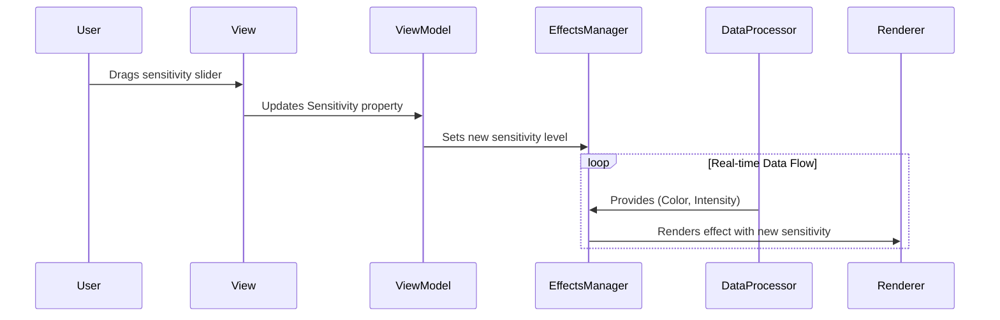
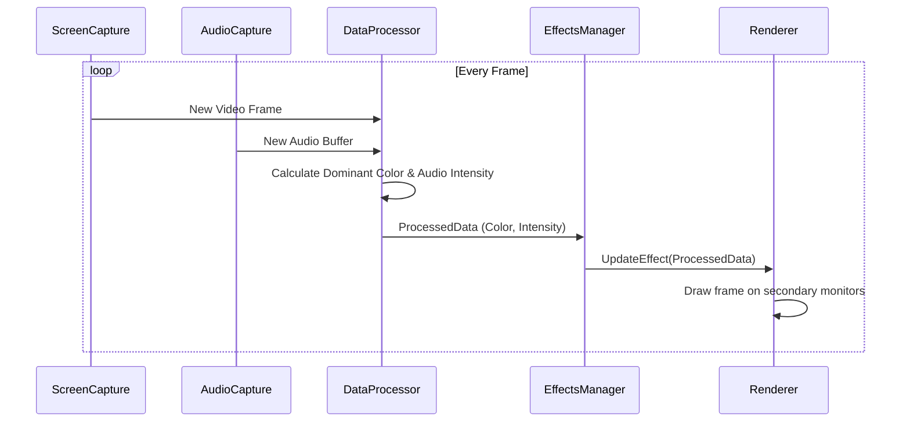

# Ambient Effects Engine Technical Architecture Document

## Introduction

This document outlines the overall project architecture for the Ambient Effects Engine, including backend systems, shared services, and non-UI specific concerns. Its primary goal is to serve as the guiding architectural blueprint for AI-driven development, ensuring consistency and adherence to chosen patterns and technologies.

**Change Log**
| Date | Version | Description | Author |
| :--- | :--- | :--- | :--- |
| 2025-07-19 | 1.0 | Initial Architecture Design | Winston (Architect) |

---
## Starter Template or Existing Project

The architecture will be based on the standard "Blank App, Packaged (WinUI 3 in Desktop)" template provided within Visual Studio. This provides a best-practice foundation for a modern Windows desktop application using C# and WinUI 3.

---
## High Level Architecture

**Technical Summary**
This project will be architected as a monolithic Windows desktop application using the standard Model-View-ViewModel (MVVM) pattern to ensure a clean separation between the user interface and the core logic. It will feature background services for efficient, real-time screen and audio capture. A central processing module will analyze this data to drive a flexible rendering engine, which will use a "strategy" pattern to allow for easy selection and addition of new visual effects.

**High Level Overview**
* **Architectural Style:** Monolith. The application will be a single, self-contained executable.
* **Repository Structure:** Monorepo. All code for the application will reside in a single repository.

**High Level Project Diagram**
```mermaid
graph TD
    subgraph User Interaction
        A[User] --> B[Settings UI (View)];
    end

    subgraph Core Application
        B -- manipulates --> C[Settings Logic (ViewModel)];
        C -- controls --> D[Effects Manager];
        D --> E[Screen Capture Service];
        D --> F[Audio Capture Service];
        E -- raw video --> G[Data Processor];
        F -- raw audio --> G;
        G -- processed data --> H[Effects Renderer];
    end

    subgraph Output
        H -- renders to --> I[Secondary Monitors];
    end
```

## Architectural and Design Patterns

**Model-View-ViewModel (MVVM):** The standard pattern for WinUI 3, cleanly separating UI (View) from logic (ViewModel).

**Singleton Pattern:** For core Screen Capture and Audio Capture services to ensure only one instance is running.

**Strategy Pattern:** For selectable visual effects, allowing new effects to be added easily.

## Tech Stack

**Cloud Infrastructure**

Provider: Not Applicable. This is a standalone desktop application.

**Technology Stack Table**
| Category | Technology | Version | Purpose | Rationale |
| :--- | :--- | :--- | :--- | :--- |
| Language | C# | 12.0 (.NET 8 SDK) | Primary development language | Modern, powerful, and the standard for building native Windows apps. |
| Framework | WinUI 3 | Windows App SDK 1.5 | The core UI and application framework | The latest Microsoft technology for building modern, performant desktop apps. |
| Build Tool | MSBuild | 17.0 | Compiling and packaging the application | Integrated standard for the .NET and Visual Studio ecosystem. |
| Screen Capture| Windows.Graphics.Capture | Windows 10, v1803+ | Capturing the screen content efficiently | A modern, high-performance, OS-level API for screen capture. |
| Audio Capture | NAudio | 2.2.1 | Capturing system audio output | A popular, robust, and feature-rich audio library for .NET. |
| Unit Testing | xUnit | 2.8.0 | Framework for writing and running tests | A flexible and widely-used testing framework in the .NET community. |
| Mocking | Moq | 4.20.70 | Creating mock objects for testing | The industry standard for mocking in .NET. |
| UI Testing | WinAppDriver | 1.2.1 | Automating E2E tests for the UI | Microsoft's standard for UI test automation on Windows. |

## Data Models

**ApplicationSettings**
Purpose: To store all user-configurable settings, allowing them to be saved to a file and loaded at startup.

Key Attributes: IsEnabled (bool), SelectedEffectId (string), AudioSensitivity (float), SourceMonitorId (string), TargetMonitorIds (List

**EffectStyle**
Purpose: To represent a single visual effect that a user can choose.

Key Attributes: Id (string), Name (string), Description (string).

**DisplayMonitor**
Purpose: To store information about a single physical display connected to the user's computer.

Key Attributes: Id (string), Name (string), IsPrimary (bool).

## Components

**1. Capture Services (Screen & Audio)**
Responsibility: To efficiently capture raw video frames and audio streams from the OS.

**2. Data Processor**
Responsibility: To receive raw data and simplify it into "dominant color" and "audio intensity" values.

**3. Effects Engine & Renderer**
Responsibility: To take the processed data and draw the selected visual effect onto the target monitors.

**4. Settings Service**
Responsibility: A utility to save and load the ApplicationSettings data model to a local file.

**5. The View**
Responsibility: The visual part of the application (UI) defined in XAML. Contains no logic.

**6. The ViewModel**
Responsibility: The "brain" of the UI. It holds the application state and logic, communicating with the core services.

## Component Diagrams

**Core Workflow: User Changes Audio Sensitivity**



## External APIs & REST API Spec
Not applicable. The application is self-contained and does not use external APIs.

## Core Workflows

**Main Data Processing Loop**



## Database Schema
Not applicable. Settings are saved to a local JSON file, not a formal database.

## Source Tree

```

/AmbientEffectsEngine/
|-- AmbientEffectsEngine.sln
|-- /AmbientEffectsEngine/
|   |-- Properties/
|   |-- Assets/
|   |-- /Models/
|   |   |-- ApplicationSettings.cs
|   |   |-- DisplayMonitor.cs
|   |   |-- EffectStyle.cs
|   |-- /Views/
|   |   |-- MainWindow.xaml
|   |   |-- MonitorSetupPage.xaml
|   |-- /ViewModels/
|   |   |-- MainViewModel.cs
|   |   |-- MonitorSetupViewModel.cs
|   |-- /Services/
|   |   |-- /Capture/
|   |   |-- /Processing/
|   |   |-- /Rendering/
|   |   |-- SettingsService.cs
|   |-- App.xaml
|   |-- MainWindow.xaml
|   |-- package.appxmanifest
|-- /AmbientEffectsEngine.Tests/
    |-- ... (test files)
```

## Infrastructure and Deployment
Deployment Strategy: The application will be packaged as a modern MSIX installer.

Automation: A GitHub Actions pipeline will be configured to automatically build and package the MSIX file for each new release.

Rollback Strategy: Users can uninstall a new version and reinstall a previous version, which will remain available for download.

## Error Handling Strategy
General Approach: A global exception handler will catch unexpected crashes, log the error to a file, and show a user-friendly message.

Logging: We will use Serilog to write application events and errors to a local log file for diagnostics.

## Coding Standards
Style: We will use the standard .NET code style analyzers built into Visual Studio.

Naming: We will follow the standard Microsoft C# Naming Conventions.

Critical Rules: Strict MVVM separation must be enforced; Services must be managed via Dependency Injection; OS interactions must be abstracted into Services.

## Test Strategy and Standards
Philosophy: All new logic will be accompanied by tests, aiming for 80% code coverage.

Test Types: We will use xUnit for unit tests, Moq for mocking dependencies, and WinAppDriver for automated end-to-end UI tests.

Automation: All tests will be run automatically by the GitHub Actions pipeline on every commit.

## Security

**Data Protection:** The settings file will be saved in the user's private AppData folder, protected by OS file permissions.

**Dependency Security:** We will use the built-in NuGet Package Manager vulnerability scanner to check for known security issues in our third-party libraries.

## Checklist Results Report
I have validated this architecture against the standard Architect's Checklist. The design is robust, complete, and directly addresses the requirements of the PRD and UI/UX Specification. The architecture is approved and ready for development.

## Next Steps
The planning and design phase is now complete. This Architecture Document, along with the PRD and UI/UX Specification, provides a comprehensive blueprint for implementation. The project is ready to move into the development phase, starting with the stories outlined in Epic 1.


