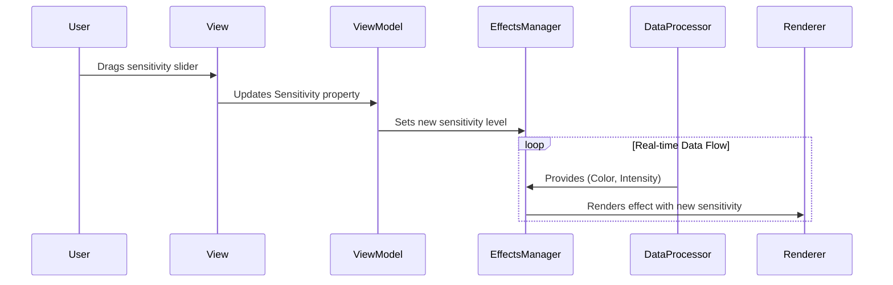

# Component Diagrams

**Core Workflow: User Changes Audio Sensitivity**

```mermaid
sequenceDiagram
    participant User
    participant View
    participant ViewModel
    participant EffectsManager
    participant DataProcessor
    participant Renderer

    User->>View: Drags sensitivity slider
    View->>ViewModel: Updates Sensitivity property
    ViewModel->>EffectsManager: Sets new sensitivity level
    loop Real-time Data Flow
        DataProcessor->>EffectsManager: Provides (Color, Intensity)
        EffectsManager->>Renderer: Renders effect with new sensitivity
    end
```

