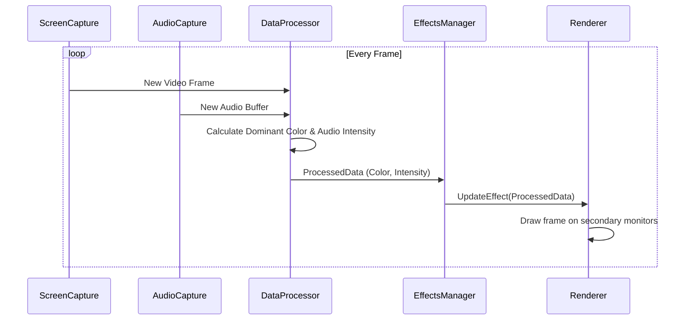

# Core Workflows

**Main Data Processing Loop**

```mermaid
sequenceDiagram
    participant ScreenCapture
    participant AudioCapture
    participant DataProcessor
    participant EffectsManager
    participant Renderer

    loop Every Frame
        ScreenCapture->>DataProcessor: New Video Frame
        AudioCapture->>DataProcessor: New Audio Buffer
        DataProcessor->>DataProcessor: Calculate Dominant Color & Audio Intensity
        DataProcessor->>EffectsManager: ProcessedData (Color, Intensity)
        EffectsManager->>Renderer: UpdateEffect(ProcessedData)
        Renderer->>Renderer: Draw frame on secondary monitors
    end
```

