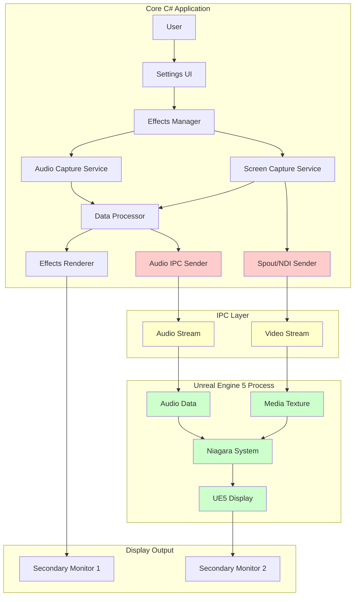

# High Level Architecture

**Technical Summary**
This project will be architected as a monolithic Windows desktop application using the standard Model-View-ViewModel (MVVM) pattern to ensure a clean separation between the user interface and the core logic. It will feature background services for efficient, real-time screen and audio capture. A central processing module will analyze this data to drive a flexible rendering engine, which will use a "strategy" pattern to allow for easy selection and addition of new visual effects.

**High Level Overview**
* **Architectural Style:** Monolith with optional hybrid extension for Epic 4 PoC (separate UE5 process).
* **Repository Structure:** Monorepo. All code for the application will reside in a single repository. The UE5 PoC may reside in a subfolder or separate branch.

**High Level Project Diagram**
```mermaid
graph TD
    subgraph User Interaction
        A[User] --> B[Settings UI (View)];
    end

    subgraph Core Application
        B -- manipulates --> C[Settings Logic (ViewModel)];
        C -- controls --> D[Effects Manager];
        D --> E[Screen Capture Service];
        D --> F[Audio Capture Service];
        E -- raw video --> G[Data Processor];
        F -- raw audio --> G;
        G -- processed data --> H[Effects Renderer];
    end

    subgraph Output
        H -- renders to --> I[Secondary Monitors];
    end
```

**Epic 4 PoC Hybrid Architecture Diagram**


Note: Components highlighted in red are new C# additions, yellow represents IPC transport, and green represents the new UE5 process components.

